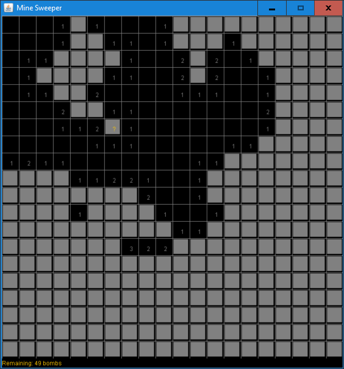

# MineSweeper

### Classic game in Java.

Graphics could be better =)

Also small glitch in the algorithm to expand region with zeros.

# Download 

Get the JAR file under [Actions](https://github.com/haphaeu/MineSweeper/actions)

# Todo:

  * [ ] Add command line arguments to choose board size and number of mines.

# Project Status

